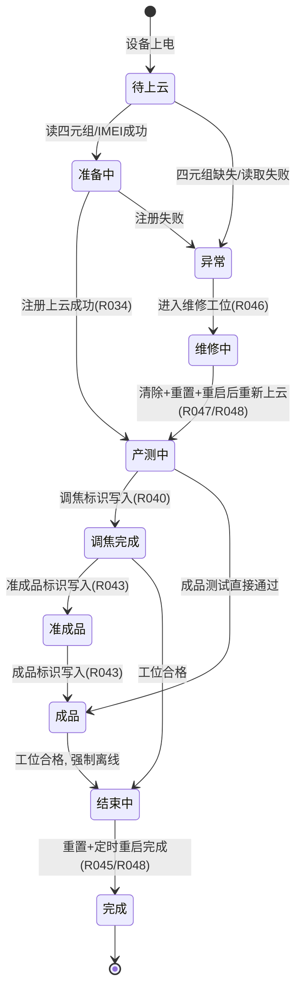
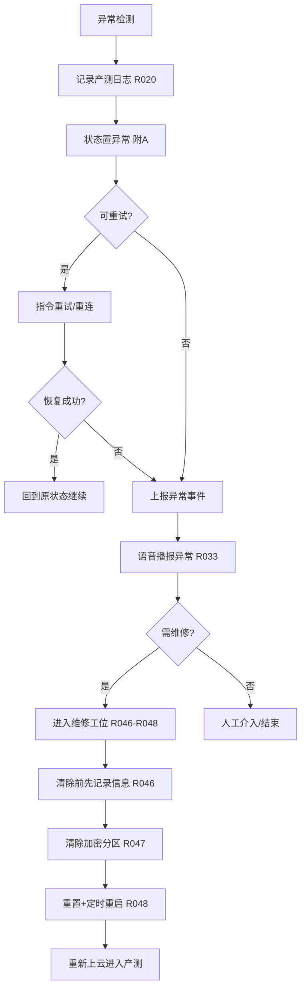

# 设备端产测功能概要设计（按阶段模块设计）

- **版本**：V1.4（按生命周期阶段重排）
- **日期**：2026-08-14
- **编制**：姚永宏
- **密级**：内部 / 项目限阅
- **配套文档**：
  - 《设备端产测功能概要设计-总流程与架构》（V1.3）
  - 《设备端产测功能概要设计-模块设计》（V1.3）
  - 《CS7G 设备端产测任务拆解表.xlsx》《CS7G 设备端产测需求分解表.xlsx》（R012–R048）
  - 《CS7G 产测工艺路线.pptx》

---

## 0 文档说明

本文档将设备端产测功能模块按**产测生命周期阶段**重新组织，作为模块设计分册（V1.3，按"功能项 / 协议流程"划分）的**按阶段视图**，便于从端到端的执行视角理解设备端行为。

### 0.1 阶段划分

| 阶段 | 范围 | 目标 |
|---|---|---|
| **阶段一 产测上云前准备** | 设备上电 → 本地信息就绪 → 等待上云注册 | 设备"能被识别、能被标识、能上云" |
| **阶段二 云端交互** | 注册上云 → 拉流/外设/标识/上报 → 各工位流程 | 接收云端指令、执行并上报结果 |
| **阶段三 产测结束** | 退出产测 → 重置+重启 → 烧录/贴标/上云验证 | 按约束退出、恢复默认、完成产测 |
| **附A 产测状态管理** | 贯穿全阶段 | 状态机与状态属性统一管理 |
| **附B 产测异常管理** | 贯穿全阶段 | 异常分类、检测与全流程处理 |

### 0.2 需求与约束来源

- 需求来源：V2.3 需求分解 **R012–R048**（设备端·产测功能项 / 设备端·测试协议流程）。
- 约束来源：4 项核心约束 **§5.1 重置协议顺序 / §5.2 加密分区读写 / §5.3 长电状态 / §5.4 外设测试一致性**。

### 0.3 核心交互闭环（10 步，跨阶段引用）

```
1 设备上电 ── 2 读SD卡四元组 ── 3 设备注册上云
                                  │
              4 拉流开始 ── 5 接收产测协议 ── 6 标识/信息写入
                                  │
              7 设备信息上报 ── 8 强制离线 ── 9 设备重置 ── 10 定时重启
```

| 闭环步骤 | 所属阶段 | 对应需求 |
|---|---|---|
| 1 设备上电 | 阶段一 | — |
| 2 读 SD 卡四元组 | 阶段一 | R012 |
| 3 设备注册上云 | 阶段二 | R034 |
| 4 拉流开始 | 阶段二 | R036 |
| 5 接收产测协议 | 阶段二 | R038 |
| 6 标识/信息写入 | 阶段二 | R016 / R017–R019 |
| 7 设备信息上报 | 阶段二 | R037 / R044 |
| 8 强制离线 | 阶段三 | 闭环步骤 |
| 9 设备重置 | 阶段三 | R045 / R048 |
| 10 定时重启 | 阶段三 | R045 / R048 |

---

## 阶段一 产测上云前准备阶段

> 目标：设备上电后、注册上云前，完成本地信息读取、模块初始化与产测模式适配。此时**加密分区仅预留、不写入**。

### 1.1 涉及模块与需求

| 功能模块 | 需求编号 | 说明 |
|---|---|---|
| 产测信息管理·本地读取 | R012, R015 | SD 卡四元组读取、IMEI 读取 |
| 加密串号 / InputData 准备 | R013, R014 | 等待云端下发写入（上云前不写） |
| 标记位初始化 | R017–R019 | 加密分区预留，标识待写 |
| 日志模块初始化 | R020 | 本地协议流水记录就绪 |
| 启动流程适配 | R034 | 先读四元组再上云注册 |
| 长电状态适配 | R035 | 产测期间保持长电 |
| 语音播报准备 | R032, R033 | SD 卡语音文件就绪 |

### 1.2 流程步骤

1. **设备上电**（闭环步骤 1）。
2. **读 SD 卡四元组**（R012，闭环步骤 2）：读取 MAC/SN/三元组/四元组/语言；读取失败有日志与异常提示；**四元组缺失则不允许注册上云**（强约束）。
3. **4G 模块就绪，读取 IMEI**（R015）：异常有提示；IMEI 供后续含 IMEI 的上报与 Inputdata2 生成使用。
4. **初始化加密分区**：预留 SUID / 标记位存储区（R013 / R017–R019），此时不写。
5. **初始化产测日志**（R020）：准备本地协议流水记录。
6. **初始化产测状态**为"待上云 / 准备中"（见附 A）。
7. **加载 SD 卡语音文件**（R032 / R033）：语音播报资源就绪。
8. **启动流程适配**（R034）：确认先读四元组再进入注册流程，流程异常可定位。
9. **长电状态适配**（R035）：禁止进入低功耗 / 关机。

### 1.3 关键约束

- **§5.2 加密分区读写**：准备阶段仅预留，写入须等云端指令触发。
- **§5.3 长电状态**：准备阶段即保持长电，不进入低功耗。
- **四元组强依赖**：未读取到四元组不得注册上云。

---

## 阶段二 云端交互阶段

> 目标：设备注册上云后，PC 客户端经腾讯云物模型下发指令，设备端接收执行并上报结果，完成调焦 / 准成品·成品 / 维修等工位流程。

### 2.1 涉及模块与需求

| 功能模块 | 需求编号 | 交互对象 |
|---|---|---|
| 上云注册 | R034 | 云端 / 物模型 |
| 拉流控制 | R036 | 云端 / PC |
| 产测信息获取 / 上报 | R016, R037, R044 | 云端 / PC |
| 外设控制操作适配 | R038 | 云端 / 物模型 |
| 外设测试（11 项） | R021–R031 | 云端 / 物模型 |
| 标记位下发 | R017–R019 | 云端 |
| 语音播报 | R032, R033 | 本地 / 云端事件 |
| 调焦工位 | R039, R040 | 云端 / PC |
| 准成品·成品测试工位 | R041–R045 | 云端 / PC |
| 设备维修工位（再入） | R046–R048 | 云端 / PC |

### 2.2 通用交互子流程（所有工位共用）

- **设备注册上云**（R034）：基于四元组注册，进入"产测中"状态。
- **拉流开始**（R036）：用于调焦与图像测试，拉流开始/停止可控。
- **接收产测协议**（R038）：对接云端物模型，实现外设控制、重置、重启、关机等协议（**重启前先下发重置**）。
- **标识 / 信息写入**：产测信息写入、标记位下发（R016 / R017–R019），目标为加密分区或对应存储区。
- **设备信息上报**（R037 / R044）：提供统一信息获取接口，成品测试后上报含 IMEI 的产测信息。

### 2.3 工位流程

#### 2.3.1 调焦工位（R039–R040）

```
上云 → 拉流开始(R036) → 获取产测信息(R039) → 无尘室调焦 → 下发调焦标识(R040) → 拉流停止(R036)
```

- 顺序固定：上云 → 拉流 → 获取信息 → 调焦 → 标识写入 → 拉流停止。
- 调焦完成标识写入加密分区（R040），可回读。

#### 2.3.2 准成品·成品测试工位（R041–R045）

```
获取信息(R041) → 自动化功能测试(R042, 11项外设) → 成品/准成品标识写入(R043)
             → 上报产测信息含IMEI(R044) → 重置+定时重启(R045)
```

- 准成品阶段先写准成品标识，成品通过后再写成品标识（R043）。
- 上报须在含 IMEI 且成功后（R044）。
- **重启前必须已下发设备重置协议**（R045，§5.1）。

#### 2.3.3 设备维修工位（R046–R048，异常再入）

```
获取信息(R046) → 清除加密分区数据(R047) → 重置+定时重启(R048) → 重新上云进入产测
```

- **清除以前必须先获取并记录信息**（R046 先于 R047）。
- 清除后定时重启恢复默认，设备回到可重写状态，可重新上云。
- 维修流程详见附 B 异常处理。

### 2.4 11 项外设测试（R021–R031）

| 外设类型 | 指令 | 执行要点 | 需求 |
|---|---|---|---|
| 指示灯 | 指示灯控制 | 点亮/熄灭/闪烁；返回当前状态 | R021 |
| 红外灯 | 红外灯控制 | 切换 IR；夜间补光场景 | R022 |
| 白光灯 | 白光灯控制 | 点亮/熄灭/调亮度；告警场景闪烁 | R023 |
| 日夜切换 | 日夜切换 | 切换日夜模式（IRCUT/滤光片） | R024 |
| 复位按键 | 复位按键 | 开机/关机/切换SIM卡/重置；需确认电源状态 | R025 |
| 电池 | 电池电量查询 | 返回电量百分比；低电告警 | R026 |
| 云台控制 | 云台控制 | 水平/垂直转动；限位保护 | R027 |
| 喇叭 | 喇叭测试 | 播放测试音频；返回音量 | R028 |
| 咪头 | 咪头测试 | 采集音频并返回分贝值 | R029 |
| 4G | 4G 测试 | 返回信号强度/运营商/拨号状态 | R030 |
| SD 卡 | SD 卡测试 | 返回容量/可用空间/读写测试结果 | R031 |

- 指令载荷含**外设类型 + 参数**；结果（成功/失败/超时/具体值）以属性上报 + 回复指令返回。
- 测试项由 PC 按「测试项能力集」动态下发，支持机型/工位差异化。

### 2.5 语音播报（R032–R033）

- **阶段播报**（R032）：读取 SD 卡语音文件，播报阶段产测状态，不阻塞主流程。
- **异常播报**（R033）：异常时每 5 秒重复播报，恢复后停止。

### 2.6 关键约束

- **§5.1 重置协议顺序**：重启前先下发重置；重置不抹掉加密分区标识。
- **§5.2 加密分区读写**：仅经云端指令写入；幂等；非法数据拒绝并回复失败。
- **§5.4 外设测试一致性**：测试项按能力集动态下发；同指令重复结果一致；失败项明确。

---

## 阶段三 产测结束阶段

> 目标：工位流程完成且结果合格后，设备按约束退出产测、恢复默认，并进入烧录检测 / 包装贴标 / 上云验证。

### 3.1 涉及模块与需求

| 功能模块 | 需求编号 | 说明 |
|---|---|---|
| 强制离线 | 闭环步骤 8 | 退出产测交互 |
| 设备重置 | R045, R048 | 恢复默认配置，不抹标识 |
| 定时重启恢复默认 | R045, R048 | 按规定延时重启 |
| 烧录检测 | 设备端烧录检测适配 | 校验烧录信息一致性 |
| 上报产测信息（终态） | R044 | 含 IMEI 终态上报 |
| 完成标记 | R017 / R043 | 成品标识已写 |

### 3.2 流程步骤

1. **工位流程完成，结果合格**（PC 确认 / 云端状态）。
2. **强制离线**（闭环步骤 8）：退出产测交互。
3. **设备重置**（R045 / R048）：恢复默认配置，**不抹加密分区标识**。
4. **定时重启**（R045 / R048）：按规定延时重启，恢复默认。
5. **烧录检测**：校验烧录信息（SD 卡四元组 / 串号一致性）。
6. **包装贴标**：铜板贴 / IMEI 贴 / 彩盒贴 + 一致性校验（PC 端主导，设备端提供 IMEI / 信息）。
7. **上云测试**：重新上云验证产测信息可读、标识正确。
8. **产测完成**：成品标识已写，状态置"完成"（见附 A）。

### 3.3 关键约束

- **§5.1 重置协议顺序**：重置先于重启，且重置不抹加密分区标识。
- **§5.3 长电状态**：退出产测仅允许"重置 → 重启"路径。
- 贴标一致性依赖 R044 上报的 IMEI 准确。

---

## 附A 产测状态管理

> 目标：统一描述设备端产测过程中的状态属性与状态机，贯穿全部三个阶段。

### A.1 状态属性（物模型）

| 属性 | 类型 | 说明 |
|---|---|---|
| 产测状态 | 枚举 | 在线 / 离线 / 产测中 / 异常 / 完成 |
| 在线状态 | 布尔 | 设备与云端连接状态 |
| 加密分区标识 | 枚举集 | 调焦标识 / 准成品标识 / 成品标识（可空） |

### A.2 状态机



### A.3 状态转换表

| 当前态 | 触发事件 | 下一态 | 动作 / 需求 |
|---|---|---|---|
| 待上云 | 四元组/IMEI 读取成功 | 准备中 | R012 / R015 |
| 待上云 | 读取失败 | 异常 | 记日志(R020)、语音播报(R033) |
| 准备中 | 注册上云成功 | 产测中 | R034 |
| 产测中 | 调焦标识写入 | 调焦完成 | R040 |
| 调焦完成 | 准成品标识写入 | 准成品 | R043 |
| 准成品 | 成品标识写入 | 成品 | R043 |
| 成品 / 调焦完成 | 工位合格、强制离线 | 结束中 | 闭环步骤 8 |
| 结束中 | 重置+定时重启完成 | 完成 | R045 / R048 |
| 异常 | 进入维修工位 | 维修中 | R046 |
| 维修中 | 清除+重置+重启后重新上云 | 产测中 | R047 / R048 |

---

## 附B 产测异常管理（全流程）

> 目标：覆盖产测全生命周期的异常分类、检测与处理流程，确保异常可发现、可恢复、不重复写入/重启。

### B.1 异常分类

| 类型 | 触发条件 | 影响范围 | 关联约束 |
|---|---|---|---|
| 超时 | 指令下发超时 / 回复超时 | 当前工位阻塞 | §5.2 / §5.4 |
| 断线 | 设备离线 / 云端失联 | 交互中断 | §5.3 |
| 外设测试失败 | 单项 / 多项外设异常 | 工位不通过 | §5.4 |
| 数据校验失败 | 四元组缺失 / InputData 非法 / 加密分区写失败 | 注册或写入失败 | §5.2 |
| 重复执行 | 同指令重发 | 需幂等处理 | §5.1 / §5.2 |
| 低电 | 违反长电约束 | 状态异常 | §5.3 |

### B.2 异常处理全流程



### B.3 处理细则

- **日志优先**（R020）：所有异常先记录协议流水，供排障。
- **状态同步**（附 A）：异常即时置"异常"态，恢复后回退。
- **幂等保证**（§5.2）：标记位 / 加密分区写入重复下发结果一致；非法数据拒绝。
- **不重复重启**（§5.1）：重置 / 重启指令去重，仅"重置 → 重启"一次路径。
- **外设失败隔离**（§5.4）：单项失败明确失败项，不阻塞其他项执行。
- **维修再入顺序**：清除以前必须先获取并记录信息（R046 先于 R047）；清除后恢复默认可重写。

---

## 附录：核心约束汇总（§5.1–5.4）

| 约束 | 规则 | 涉及阶段 / 模块 |
|---|---|---|
| §5.1 重置协议顺序 | 重启前必须先下发设备重置；重置不抹掉加密分区标识 | 阶段二/三：3.2 / 4.5 / 4.6 |
| §5.2 加密分区读写 | 仅经云端指令写入；幂等；非法数据拒绝 | 阶段一/二：3.1 / 3.2 / 4.4–4.6 |
| §5.3 长电状态 | 产测期间不掉低功耗；仅"重置→重启"退出产测 | 阶段一/二/三：4.3 / 4.5 / 4.6 |
| §5.4 外设测试一致性 | 测试项按能力集动态下发；同指令重复结果一致；失败项明确 | 阶段二：3.4 / 4.5 |

---

*本文档为 V1.3 模块设计分册的按阶段视图，便于端到端执行视角理解；正式交付以 docx 版（含流程图）为准，本文档可后续合并回《设备端产测功能概要设计-模块设计》。*
